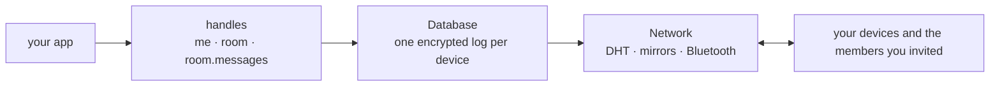

# cero

cero means zero. Zero servers. Zero accounts. Zero sync code.

You describe your data. cero stores it on the device, syncs it between your devices, and shares it with the people you invite.

```js
import { cero, t } from '@cero-base/cero'
import { spec } from './spec/index.js'

const me = await cero('./data', spec)
const room = await cero.open(me.room, { name: 'general' })

await cero.put(room.messages, { text: 'hi' })
console.log(await room.invite()) // give this to a friend
```

Your friend, on their own machine:

```js
const room = await cero.open(me.room, { invite })
for await (const { data } of cero.watch(room.messages)) console.log(data)
```

That is a working, encrypted, offline-first, peer-to-peer chat.

## How it works

**Everything is a handle. Handles contain refs. Refs contain rows.** `me` is you. A room is a child handle you open from `me` and share by invite. `room.messages` is a ref, and the same twelve operators work on every ref, in process or over RPC.



Every write is an op in this device's own log. Peers replicate each other's logs and apply them in one deterministic order, so every device arrives at the same rows with no coordinator. [How it works](docs/README.md#how-it-works) has the longer version.

## Docs

Start with the [quickstart](docs/quickstart.md), then follow the guides in order. The [docs index](docs/README.md) lists every page.

|                                     |                                                                  |
| ----------------------------------- | ---------------------------------------------------------------- |
| [Quickstart](docs/quickstart.md)    | The three files every cero app has, and a second device.         |
| [Guides](docs/README.md#guides)     | Schema, data, rooms, identity, apps, extensions, files, network. |
| [Examples](docs/examples.md)        | A CLI, an Electron app and an Expo app.                          |
| [API reference](docs/api.md)        | Every export on one page.                                        |
| [Advanced](docs/README.md#advanced) | The core primitives, encryption, devtools.                       |

## Packages

| Package                              | What it is                                                                                                        |
| ------------------------------------ | ----------------------------------------------------------------------------------------------------------------- |
| [`@cero-base/cero`](packages/cero)   | The SDK: `cero(dir, spec)`, the operators, rooms and invites, extensions, RPC for split apps. Start here.         |
| [`@cero-base/core`](packages/core)   | The primitives underneath: identity, database, network, pairing, storage, blobs. For when cero is too high level. |
| [`@cero-base/tools`](packages/tools) | Devtools: a read-only tap into a running app's refs, ops and stats.                                               |

Works on Node and on Bare. Ships TypeScript declarations generated from JSDoc.

## Develop

```sh
npm install
npm test
```

Each package runs its tests under Bare with `brittle-bare`, one process per file. `npm run lint` runs prettier and lunte. `node scripts/release.js <patch|minor|major>` releases all three packages at one version.

## License

Apache-2.0
