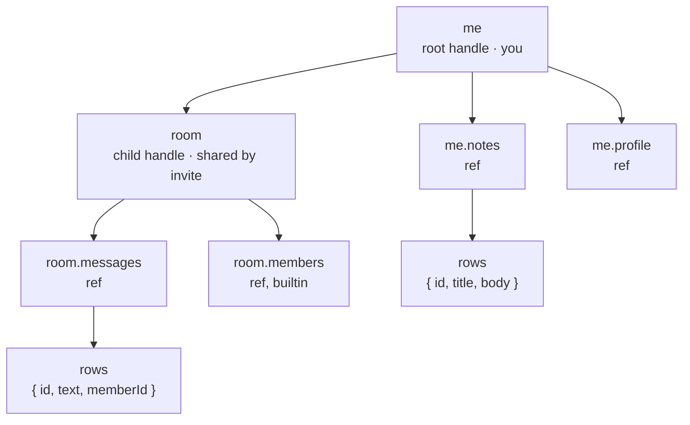
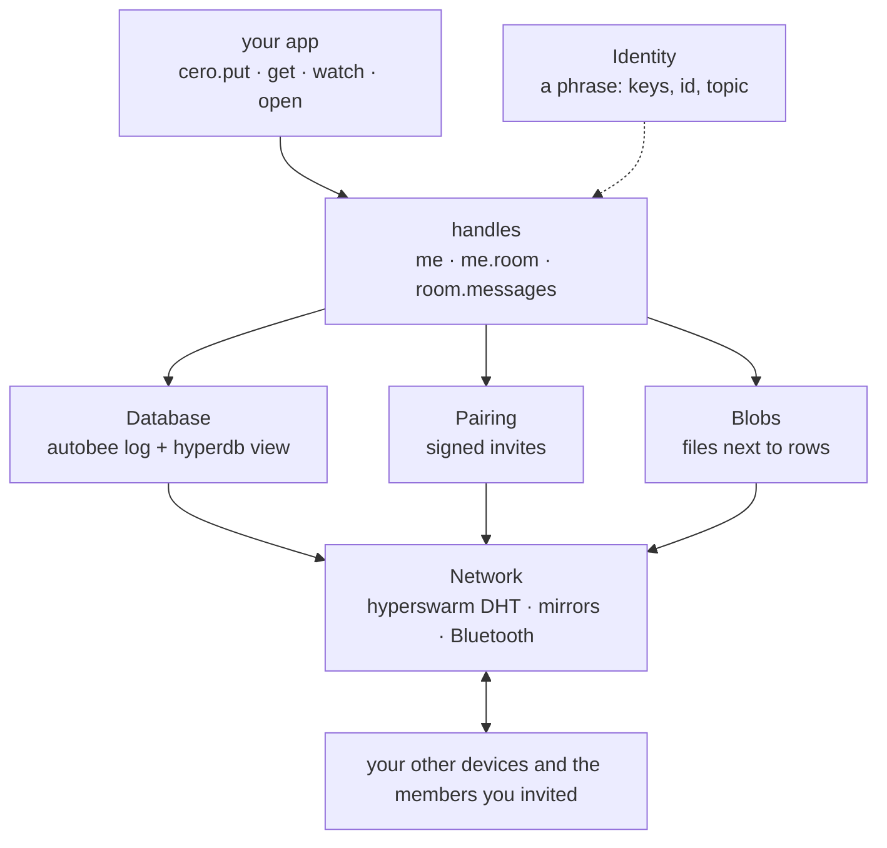

# cero

Next: [Quickstart](quickstart.md)

cero means zero. Zero servers. Zero accounts. Zero sync code.

You describe your data. cero stores it on the device, syncs it between your devices, and shares it with the people you invite.

## See it

Describe:

```js
// schema.js
import { cero, t } from '@cero-base/cero'

export const schema = cero.schema({
  room: { messages: t.collection({ text: t.string }) }
})
```

Build, once:

```js
// build.js
import { build } from '@cero-base/cero/build'
import { schema } from './schema.js'

await build('./spec', schema)
```

Use:

```js
import { cero } from '@cero-base/cero'
import { spec } from './spec/index.js'

const me = await cero('./data', spec)
const room = await cero.open(me.room, { name: 'general' })

await cero.put(room.messages, { text: 'hi' })
console.log(await room.invite()) // give this to a friend
```

Your friend, on their own machine:

```js
const room = await cero.open(me.room, { invite })
for await (const { data } of cero.watch(room.messages)) console.log(data)
```

That is a working, encrypted, offline-first, peer-to-peer chat.

## How to think about it

**Everything is a handle. Handles contain refs. Refs contain rows.**



Handles contain refs, refs contain rows. `cero.open` gives you a handle, every other operator takes a ref.

```js
me // the root handle: you, your devices, your child handles
me.notes // a ref: a table on the root
room = await cero.open(me.room, { name }) // a child handle: a space you share
room.messages // a ref on it, same operators
room.members // a builtin ref every handle has
```

A handle is one database plus its network session. The root handle is the user. A child handle is a space the user opens and shares by invite, its own database with its own encryption key. The examples call it a room; your app may call it a team, a project or a chat.

A ref is a table on a handle: the ones from your schema, plus `members`, `devices`, `invites`, `handles` and `files` on every handle. Every operator takes a ref first, and the same twelve operators work on every ref, in process or over RPC.

Your identity is a phrase. The first device mints it and shows it once. The same phrase on another device is the same user, with that device's own writer.

Three rules follow from this:

1. **Build once, open against the build.** The schema compiles to `spec/`, and your app imports `spec/`, never the schema.
2. **Add to the schema, never reorder it.** Fields are numbered in declaration order. New fields go at the end.
3. **`put` inserts, `set` merges.** A one-field change is `cero.set(ref, { id, done: true })`.

## How it works



Follow one message:

1. `cero.put(room.messages, { text: 'hi' })` encodes the op and checks it against your role in the room.
2. The op is appended to this device's own log for that handle, encrypted with the handle's key. Every device writes only its own log.
3. Peers holding the handle replicate the log and apply the op in one deterministic order into their local view. Roles are checked again on every peer, from the log itself, so no peer can be talked into a write its role forbids.
4. Every device arrives at the same rows without a coordinator. `watch` streams emit, and a mirror keeps the ciphertext for whoever is offline.

Every op carries the app version its spec was built at, so old and new builds coexist and an old build knows when to ask for an update.

## Good to know

- Offline is normal. Writes land locally first and sync when a peer is reachable, in either direction.
- A mirror keeps your data available while you are offline. It stores ciphertext and can never read it.
- A removed member keeps what they already had and nothing after. Rotate the key and the future is closed to them.
- The same code runs on Node and on Bare, in process, in an Electron worker or in an Expo worklet. Only the transport changes.

## Pages

Read them in order the first time. Every page links to the previous and the next one. Working with an AI agent? Point it at [skills/cero/SKILL.md](../skills/cero/SKILL.md), the short version of these pages.

### Start

| Page                           | What you learn                                           |
| ------------------------------ | -------------------------------------------------------- |
| [quickstart.md](quickstart.md) | The three files every cero app has, and a second device. |

### Guides

| Page                           | What you learn                                                 |
| ------------------------------ | -------------------------------------------------------------- |
| [schema.md](schema.md)         | Describing data: fields, singles, collections, rooms, actions. |
| [data.md](data.md)             | put, get, watch and the rest. Queries. Hooks.                  |
| [handles.md](handles.md)       | Child handles: opening, invites, roles, members and devices.   |
| [identity.md](identity.md)     | Your phrase, your devices, recovery.                           |
| [apps.md](apps.md)             | A backend process and a UI process, three lines each.          |
| [extensions.md](extensions.md) | Behaviour and schema you reuse across apps.                    |
| [files.md](files.md)           | Store a file next to a row.                                    |
| [network.md](network.md)       | Channels, mirrors, backgrounding, Bluetooth.                   |
| [examples.md](examples.md)     | Four runnable apps, and which guide each one pairs with.       |

### Reference

| Page                   | What you learn                           |
| ---------------------- | ---------------------------------------- |
| [api.md](api.md)       | Every export, every option, in one page. |
| [errors.md](errors.md) | Every error code and when you see it.    |

### Advanced

| Page                           | What you learn                                         |
| ------------------------------ | ------------------------------------------------------ |
| [core.md](core.md)             | The primitives under cero, opened by hand.             |
| [encryption.md](encryption.md) | Epochs, and rotating a room's key when someone leaves. |
| [tools.md](tools.md)           | Devtools: tap, stats, redact, loopback.                |
