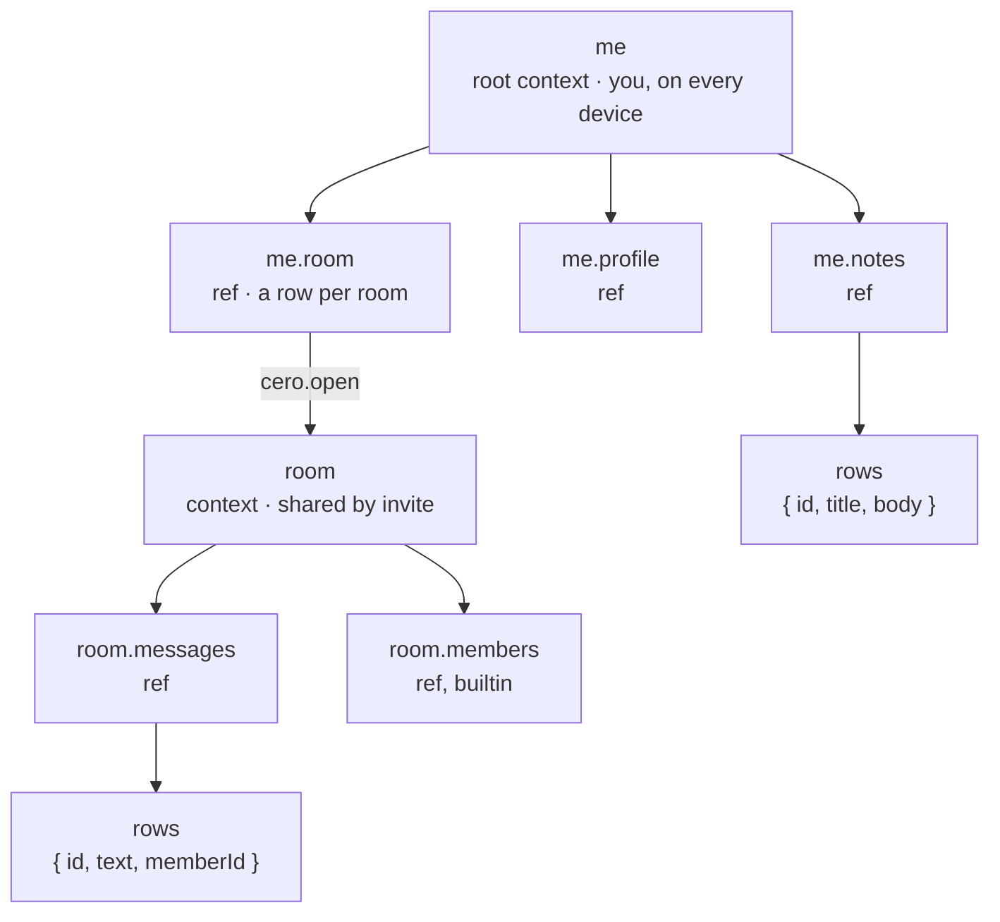
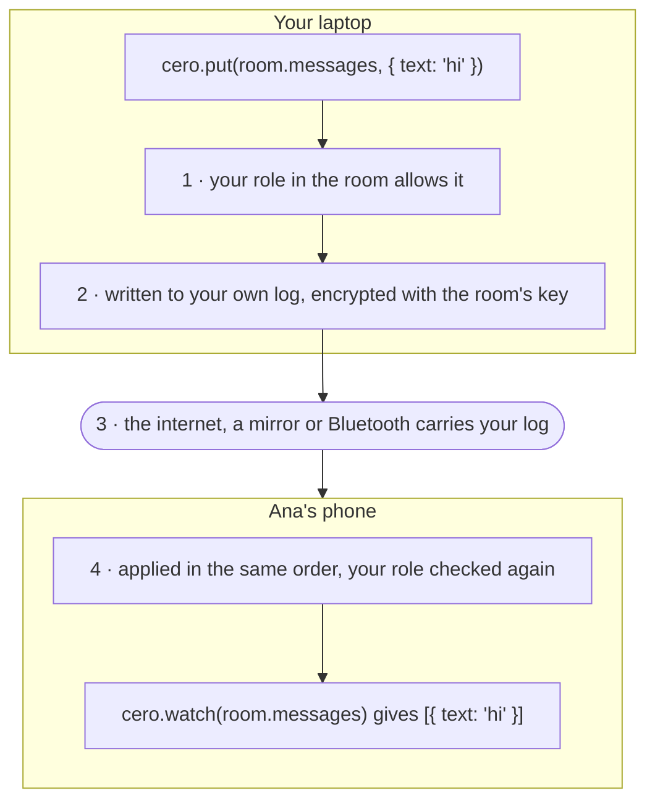

# How it works

Predict what your app shows offline, on a conflict, on a removal and on a join.

```js
// room from cero.open, as in the quickstart
for await (const { data } of cero.watch(room.status)) {
  console.log(data) // { role, writable, epoch, suspended, behind, nearby }
}
```

## The model

A room is a database with its own rows, members and key, synced among its members' devices. `me`, the root, is a database only your devices share. Both are contexts: a context holds refs, a ref holds rows, and every act on them is a `cero.` verb.



## One message, from put to a friend's watch



1. **Check.** `cero.put(room.messages, { text: 'hi' })` checks your role in the room before anything is written.
2. **Write.** The message is appended to your device's own log for the room, encrypted with the room's key. Every device writes only its own log.
3. **Sync.** Ana's phone copies your log: straight from you over the internet, from a mirror when you are offline, or over Bluetooth with no internet at all.
4. **Apply.** Every device applies every log in the same order and checks roles again from the log itself, so all of them end with the same rows, with no server in between. Ana's `watch` fires with the new row.

## Joining a room

1. **Ask.** The joiner's device starts its own log for the room and writes the join as its first entry, sealed to the room and signed twice: by the invite, and by the joiner for that log and the address its keys go to.
2. **Reach.** The room's peers and mirrors get that log, and any member's device with the room open pulls it in.
3. **Admit.** Every device checks both signatures and the invite's row, and turns away a member whose removal came after the invite. Then, in one step, it adds the member and the device, lets the log write if the role writes, and spends a single-use invite.
4. **Keys.** Every online device of a member who can invite sends the joiner the room's keys, directly and through mirrors, until one is read.
5. **Expiry.** Past an invite's expiry, a device of a member who can remove drops the invite and removes any joiner still without keys.

An invite made with `confirm: true` pauses at step 3: the join waits in `room.requests` until a member who can invite accepts it, at the invite's role or lower, or denies it and the joiner gets `DENIED`. The first answer settles it everywhere.

## Your devices and recovery

A phrase is the user, and every device of yours holds it. Each device writes only its own log, in the root and in every room, so no two devices write over each other.

The first device writes the root's address into a small log only the phrase can sign. A new device given the phrase reads that address from any device of yours online, or from a mirror, copies the root, and admits a fresh log of its own with the phrase's signature. Each room is a row in the root with its keys, so the device takes a seat in a room the same way when it opens it.

Removing a device takes its log out, but the device still holds the seed and can admit a fresh log like any new device. Removing retires a device; it does not lock out whoever holds it. `storageKey` keeps the seed encrypted on disk.

## Encryption and re-keying

Each room has its own key, made at creation, kept in your root and handed to joiners at step 4; the root's key comes from the phrase. Mirrors, and peers without the key, see only ciphertext.

A removal takes the member's logs out at once, but their key would still read what comes next. So the room re-keys: a new secret, sealed to each remaining member and announced in its log, for every row and file written after.

- Half a second after a removal lands, a device of an admin or the owner with the room open re-keys it, or the next one to come online. `cero.rotate(room)` re-keys at once and resolves when the key is in place: await it before writing what the removed member must not read.
- Once a room has re-keyed, any change of members re-keys it again, joins included.
- Each re-key starts an epoch, `status.epoch`. Every block names its epoch, so a reader picks the right key in any arrival order.
- A removed member never learns a new epoch. The removal lands first, so they see it: `status.role` turns `null` and what they read stops there.

A member who joins later gets every epoch's key and reads the whole history.

## Offline and conflicts

Every write lands in its device's own log first, so it shows at once and syncs when a peer is reachable. The logs merge in one order every device computes alike, each write after everything its device had seen. Writes made apart that arrive late are fitted in by undoing and applying again, so every device ends on the same rows.

The last write in that order wins, per row: `set` merges on the writing device and sends the whole row, so two offline edits to one row keep the later one whole. A write ordered after its author's removal is refused everywhere. Hooks run with every applied write, on every device and again after an undo, which is why a hook reads only its `ctx`, never a clock or local state.

## App versions

Every write carries its spec's version, which the build raises when the schema changes. An older build skips writes from a newer one, the same way on every device, and `status.behind` shows the newer version so the app can ask for an update. Once updated, it applies the writes it skipped. Newer builds read older writes as they are, which is why the schema only grows.

## Next

- [API reference](api.md) for every verb and status field named here.
- [Errors](errors.md) for the codes a refused write or a join returns.
- [Sharing](handles.md) for invites, roles and removal as your app uses them.
